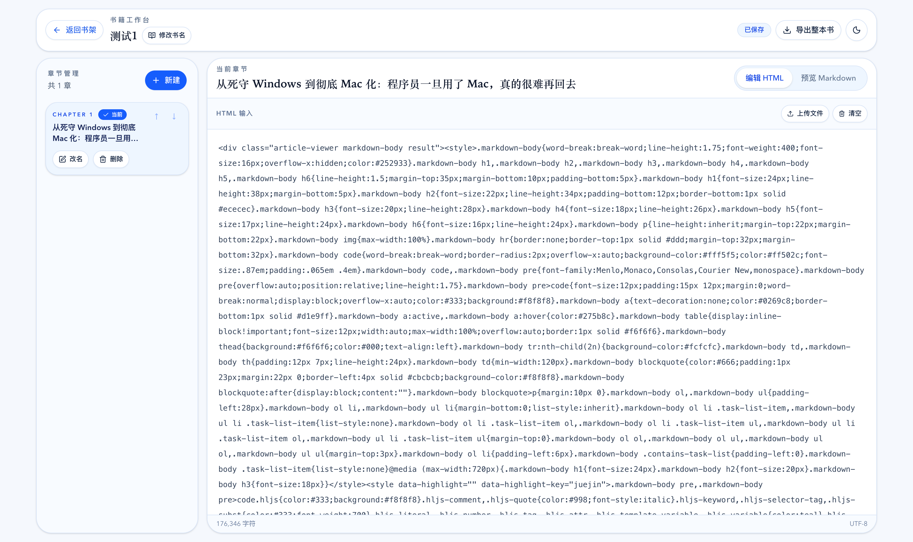
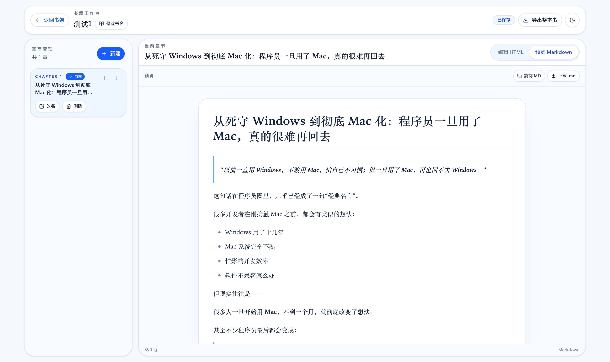

# html2md

一个面向“书籍整理”场景的 HTML 转 Markdown 工具。它不是单纯的转换器，而是一个本地书架应用：你可以把多章 HTML 内容整理成一本书，自动生成 Markdown，导出整书，也可以通过 `book.json` 重新导入继续编辑。

适合这类场景：
- 把爬取、复制或保存下来的章节 HTML 整理成一本结构化书稿
- 在本地逐章维护内容，并随时查看 Markdown 预览
- 导出为适合存档、发布或二次加工的 Markdown 文件集
- 通过备份文件恢复整本书的编辑状态

## 特性

- 本地书架管理：创建、删除、浏览多本书
- 章节工作台：新建、重命名、删除、排序章节
- HTML 自动转 Markdown：编辑时自动保存并生成 Markdown
- 阅读型预览：更接近书页阅读的 Markdown 排版
- 整书导出：导出 zip，包含章节 `.md`、`README.md`、`toc.json`、`book.json`
- 单文件恢复：支持直接导入 `book.json`
- 纯前端持久化：数据存储在浏览器 IndexedDB
- GitHub Pages 友好：支持静态导出部署

## 在线体验

如果你已经启用了 GitHub Pages，可以把在线地址放在这里：

```text
https://<your-name>.github.io/<your-repo>/
```

## 技术栈

- Next.js 15
- React 19
- TypeScript
- Tailwind CSS 4
- Ant Design
- `turndown` + `turndown-plugin-gfm`
- `react-markdown` + `remark-gfm` + `rehype-raw`
- IndexedDB
- JSZip

## 开发方式

这个项目采用 `vibe coding` 的方式完成，主要由 CC和Codex 协作开发与迭代实现。

本项目开发过程中使用了这些能力：

- Codex：负责代码实现、重构、调试、文档同步与部署改造
- `superpowers`：用于提升整体开发效率与工程推进节奏
- `ui-ux-pro-max`：用于优化界面体验、阅读式排版和整体视觉方向

项目中的书架体验、阅读型 Markdown 预览、导入导出链路以及 GitHub Pages 静态部署改造，均是在这套协作方式下逐步完成的。

## 项目截图

你可以在这里补几张截图：

- 书架页


- 章节工作台



- Markdown 预览



## 本地开发

```bash
npm install
npm run dev
```

默认访问：

```text
http://localhost:3000
```

其他常用命令：

```bash
npm test
npm run build
```

## 使用方式

### 1. 创建一本书

在书架页点击“新建书籍”，输入书名后进入书籍工作台。

### 2. 添加章节

在左侧章节区新建章节，并调整顺序、改名或删除。

### 3. 粘贴或导入 HTML

在编辑区直接粘贴 HTML，或者上传 `.html/.htm` 文件。系统会自动保存，并生成对应 Markdown。

### 4. 预览 Markdown

切换到预览模式，可以查看阅读化排版的 Markdown 渲染结果，也可以复制或下载当前章节的 `.md` 文件。

### 5. 导出整本书

点击“导出整本书”后，会得到一个 zip，里面包含：

- 每章一个 `.md`
- `README.md`
- `toc.json`
- `book.json`

其中 `book.json` 是完整备份文件，包含继续编辑所需的书籍与章节数据。

### 6. 导入 `book.json`

在书架页点击“导入 book.json”，选择之前导出的 `book.json`，就可以把整本书重新恢复到本地书架中继续编辑。

## 项目结构

```text
src/
  app/
    page.tsx
    layout.tsx
    globals.css
  components/
    books/
      BookApp.tsx
      BookShelf.tsx
      BookWorkspace.tsx
    HtmlEditor.tsx
    MarkdownPreview.tsx
  lib/
    converter.ts
    books/
      export.ts
      model.ts
      repository.ts
      types.ts
```

## 设计说明

更完整的说明见：

- [docs/design.md](./docs/design.md)
- [docs/spec.md](./docs/spec.md)
- [CLAUDE.md](./CLAUDE.md)

## 当前约束

- 数据默认只保存在当前浏览器本地
- 不支持多用户协作
- 不支持 Markdown 反向编辑 HTML
- 不支持服务端同步
